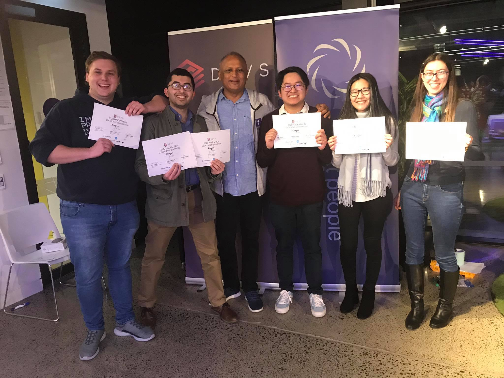
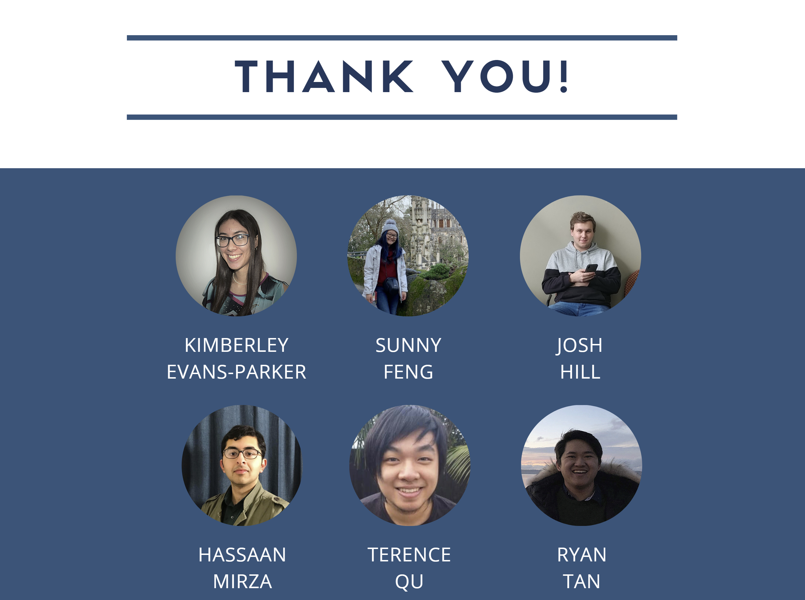

# UpSkill

UpSkill is a platform that offers live online lessons that are local with the added opportunity to network, aimed at those who have been made redundant as a result of quarantine and isolation. Our aim is to upskill, reskill and retool learners to help them re-enter the job market.

This project was built over the weekend of 17 July - 19 July as part of the 2020 DEVS Hackathon. It has a working backend to store registrations to a MongoDB database. The frontend was built using ReactJs. 

## Motivation
The theme for this year's DEVS Hackathon was "Isolation and Quarantine". Across the team, we've noticed that a lot of people were made redundant as a result of COVID-19. We decided that it would be a great idea to help others relearn industry specific skills from others, as well as providing instructors with these skills, another form of income. We validated these ideas by conducting a survey with potential students and instructors, as well as talking to potential companies that would be willing to hire fresh talent on our platform. If you'd like to get your hands on the data that we collected over the weekend, please connect with [Ryan Tan](https://www.linkedin.com/in/rtan18/) and ask for them! Our team is happy to share the data collected. 

## Results
Super happy to say that our team came first! Here's a photo of the team (without Terence Qu, as he was not able to come due another engagement):


## Installation
Make sure your device has yarn installed.
To run this project locally on your device, please open up a command prompt in the main directory and do the following:
```
$ cd frontend
$ yarn install --frozen-lockfile
$ cd ..
$ cd backend
$ yarn install --frozen-lockfile
```

You will also need to create two .env files. Note: The backend env file is named ```.env```, whereas the frontend env file is named ```.env.local``` One .env file in the backend folder, consisting of:
```
MONGO_URI = mongodb://localhost:27017
JWT_SECRET = test_secret123
CLIENT_IP = http://localhost:3000
```
For the frontend folder, create a .env.local file, consisting of:
```
REACT_APP_SERVER_IP = http://localhost:5000
```
Once this is done, change directory back to the main folder consisting of the frontend and backend folders, and run ``` yarn start ```.

## Thanks to:
[Sunny Feng](https://www.linkedin.com/in/sunnyfeng617/)  
[Kimberley Evans-Parker](https://www.linkedin.com/in/kimberley-evans-parker/)  
[Josh Hill](https://www.linkedin.com/in/josh-hill-b655131a1/)  
[Mohammad Hassaan Mirza](https://www.linkedin.com/in/mohammad-mirza/)  
[Terence Qu](https://github.com/Terenco12345)
[Ryan Tan](https://www.linkedin.com/in/rtan18/)  

